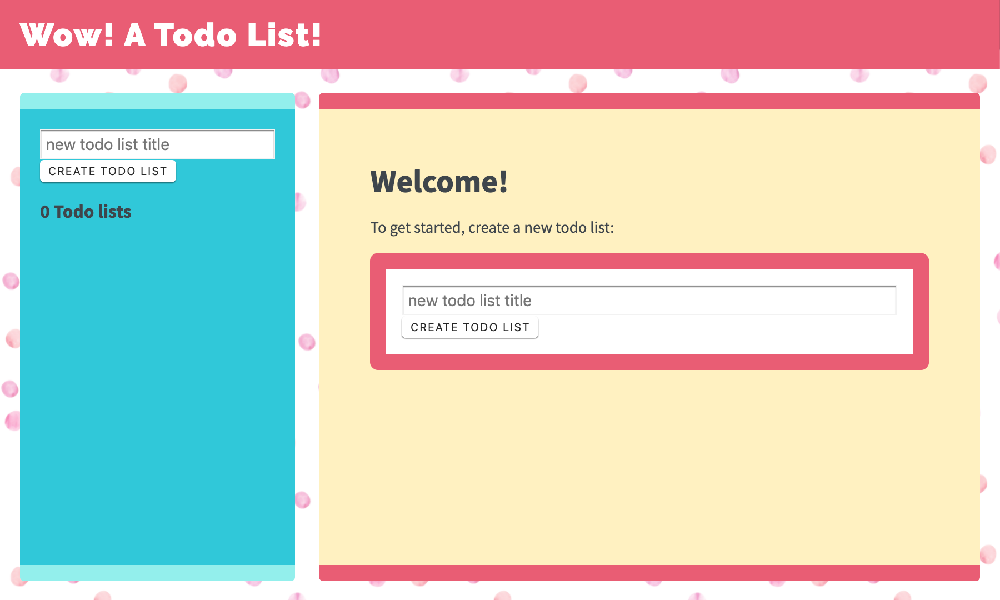

# Sweet Tooth To-Do List Example

Get a _taste_ of what it's like to work with Sweet Tooth, a
single-page app framework for Clojure! In this README, I'll guide you
through many of its features by taking you on a depth-first walk
through a single action: creating a new to-do list in a simple to-do
list app.

## Preamble

### What is Sweet Tooth?

My dream for Sweet Tooth is to make it easier, faster, and funner for
developers like you to get your ideas into production.

It does this by supporting common use cases like form handling,
navigation, and handling API calls. These use cases are not particular
to the app you're trying to build, but as a Clojurian you've likely
had to figure them out for yourself when building an SPA. In the same
way that you shouldn't have to write your own filesystem when making a
desktop app, you shouldn't have to write your own form handling system
to launch your cool idea.

I've tried to write Sweet Tooth so that using it doesn't lock you into
its own weird, arcane world the way some frameworks do. It's built on
top of popular and proven libraries like re-frame, duct, integrant,
liberator, ring, and reitit, and you can always use those libraries
directly if you need to.

The analogy I've had in mind is taken from the way we use files: files
can be structured as text, text can be structured as JSON, and JSON
can be structured as transit. Each additional degree of structure
gives you added power while requiring more special-purpose tools. Your
YAML tools won't work on a JSON file. However, you can still use the
lower-level tools; `sed` and `awk` work just fine.

Eventually, I'd like to make it dramatically easier for beginners to
make cool stuff and show it to their friends and family. For that
reason, I haven't put any effort into making use of tools like GraphQL
which can be quite powerful but harder for beginners to grok and
which, in my opinion, many apps don't need.

### What isn't Sweet Tooth?

Sweet Tooth is not for creating server-rendered apps. It hasn't been
used for high-traffic projects, so it's currently not for that,
either.

### Target Audience

This README has been written for people who have written at least one
Clojure web app. It assumes knowledge of web app development; it is
not intended for complete for beginners. (Maybe one day I'll write
that!) In particular, I'll refer to Integrant and re-frame concepts
and explain them only briefly, if at all.

I dive into Sweet Tooth internals more than I would in a tutorial that
was focused solely on building stuff with the framework because you're
experienced and I'm hoping to reveal some of its design and get your
valuable feedback :)

## Walkthrough

For the rest of this doc I'll show you Sweet Tooth's ideas and
features by walking you through what happens when you create a to-do
list. First, get the app running:

1. In a terminal, run `shadow-cljs watch dev`
2. Start a REPL. If prompted to choose between `lein`, `clojure-cli`,
   and `shadow-cljs`, choose `lein`.
3. Evaluate `(dev)` in the REPL. The REPL will pause for a little bit
   while it thinks.
4. Evaluate `(go)`.

The app should now be running at
[http://localhost:3000](http://localhost:3000) and you should see
something like this:



Now, create a to-do list by entering its title and hitting enter or
clicking the "create to-do list" button. You should see a little
activity indicator appear for a split second, then you should get
redirected to your newly-created to-do list. The URL should have
changed to something like
`http://localhost:3000/to-do-list/17592186045431`.

In even these two simple steps there's a lot going on, including:

* Initial rendering
  * App initialization
  * Route handling for `http://localhost:3000/`
  * Rendering the "home page"
* Form handling
  * Managing the input for the to-do list title
  * Submitting the form
  * Displaying an activity indicator
* API request handling
* Frontend response handling
* Navigating to the new to-do list

Let's dig in!

### Initial Rendering

What's involved in displaying the initial form and sidebar? If you
look in the `sweet-tooth.todo-example.frontend.core` namespace, you'll
see:

```clojure
(defn system-config
  "This is a function instead of a static value so that it will pick up
  reloaded changes"
  []
  (mm/meta-merge stconfig/default-config
                 {::stfr/frontend-router {:use    :reitit
                                          :routes froutes/frontend-routes}
                  ::stfr/sync-router     {:use    :reitit
                                          :routes (ig/ref ::eroutes/routes)}

                  ;; Treat handler registration as an external service,
                  ;; interact with it via re-frame effects
                  ::stjehf/handlers {}
                  ::eroutes/routes  ""}))

(defn -main []
  (rf/dispatch-sync [::stcf/init-system (system-config)])
  (rf/dispatch-sync [::stnf/dispatch-current])
  (r/render [app/app] (stcu/el-by-id "app")))
```

Most of this will be unfamiliar, but you look at the very last line
you'll see some code you might recognize:

```clojure
(r/render [app/app] (stcu/el-by-id "app"))
```

We're rendering the `app/app` component to the `<div id="app"></div>`
DOM element. Here's what that looks like:

```clojure
(defn app
  []
  [:div.app
   [:div.head
    [:div.container [:a {:href (stfr/path :home)} "Wow! A To-Do List!"]]]
   [:div.container.grid
    [:div.side @(rf/subscribe [::stnf/routed-component :side])]
    [:div.main @(rf/subscribe [::stnf/routed-component :main])]]])
```

Hmm. There's still nothing here that looks like the forms we see in
the sidebar and main area. What's going on? Here's the high level
overview, which I'll explain in detail in the sections that follow:

1. Integrant initializes system components
2. One component is a _router_ that associates URL patterns with

   * What components to display
   * Lifecycle callbacks that should get dispatched on entering or
     exiting a route
     
   (I haven't shown the router code that ties routes to components and
   lifecycle callbacks, but I'll introduce you to it later.)
3. Another component is a _nav handler_ that reacts to nav events by
   looking up the corresponding _route_, dispatching its lifecycle,
   and setting it as the current route in the appdb
4. The `[::stnf/dispatch-current]` re-frame event causes the nav
   handler to handle the current URL, dispatching its lifecycle and
   setting the current route
5. The `::stnf/routed-component` subscription pulls components for the
   current route out of the app db, and those components get rendered

Now let's go through all this in detail.

### App Initialization

When you open the home page, the app renders the home page's
components. For most projects, your app must perform some kind of
initialization process (to set up route handling, for example) to get
to this point. How does a Sweet Tooth app do it?

Briefly, Sweet Tooth provides a re-frame handler to initialize an
[Integrant](https://github.com/weavejester/integrant) _system_ (check
out the Integrant docs for a description of what a system is and how
Integrant provides a mechanism for starting and stopping
components). The system includes a component for managing nav events,
like loading the initial page or clicking a link. This nav component
looks up the _route_ for the current URL in a
[reitit](https://github.com/metosin/reitit) router. The route defines
_lifecycle callbacks_ and also defines which high-level components
should get displayed.

We'll look at each of these parts of the framework and how we use them
in our app.

First, let's look at the `sweet-tooth.todo-example.frontend.core`
namespace again:

```clojure
(defn system-config
  "This is a function instead of a static value so that it will pick up
  reloaded changes"
  []
  (mm/meta-merge stconfig/default-config
                 {::stfr/frontend-router {:use    :reitit
                                          :routes froutes/frontend-routes}
                  ::stfr/sync-router     {:use    :reitit
                                          :routes (ig/ref ::eroutes/routes)}

                  ;; Treat handler registration as an external service,
                  ;; interact with it via re-frame effects
                  ::stjehf/handlers {}
                  ::eroutes/routes  ""}))

(defn -main []
  (rf/dispatch-sync [::stcf/init-system (system-config)])
  (rf/dispatch-sync [::stnf/dispatch-current])
  (r/render [app/app] (stcu/el-by-id "app")))
```

As is tradition for Lispers, let's start at the bottom and work our
way up. In the `-main` function, you can see we're dispatching two
events and then rendering a component. Let's walk through the
mechanics of what's going on, and then we'll talk about why it works
the way it does.

The first event is:

```clojure
(rf/dispatch-sync [::stcf/init-system (system-config)])
```

`(system-config)` returns an Integrant config, a map describing a
system where each key corresponds to the name of a _system component_
(as opposed to a React compononent) and each value is that component's
configuration. Examples of system components include nav handlers that
react to History events and web worker managers.

Sweet Tooth comes with a bunch o' system components that are meant to
make your life easier, and the default config for those components
lives at `stconfig/default-config`. In the `system-config` function we
merge the default Sweet Tooth config with our app's particular
config. We use
[`meta-merge`](https://github.com/weavejester/meta-merge) because of
its support for deep merging and because of how it gives you some
control over how the two values get merged.

This system config is the payload for the `::stcf/init-system`
event. This event [results in integrant getting
called](https://github.com/sweet-tooth-clojure/frontend/blob/master/src/sweet_tooth/frontend/core/flow.cljc#L123)
to _initialize_ the system:

```clojure
(rf/reg-event-fx ::init-system
  (fn [_ [_ config]]
    {::init-system config}))

(rf/reg-fx ::init-system
  (fn [config]
    (reset! rfdb/app-db {:sweet-tooth/system (-> config
                                                 ig/prep
                                                 ig/init)})))
```

Integrant initializes an app by initializing individual components in
dependency order; the nav handler component depends on a router
component, so the router gets initialized before the nav handler.

Why do we use Integrant to initialize our app? A few reasons:

1. Sometimes we want to render different React components at different
   stages of the system's readiness. For example, you might want to
   show a loading indicator while the app sets up whatever state is
   necessary for it to be used, and then render the app proper once
   the system is ready. Integrant makes it a lot easier to determine
   when the system is ready.
2. Integrant has a very simple model for handling both initializing
   _and_ halting a system. This is very useful for local development
   with livereload when you have components that modify global state,
   for example by attaching event listeners to the window. Livereload
   can call `(ig/halt!)` on the system, giving each component to clean
   up after itself (remove its listeners) before code gets reloaded.
3. Integrant makes it easier to code to interfaces. The nav handler
   component depends on a router, and by default it depends on a
   reitit router. However, you could provide a bidi or silk router
   instead, as long as it can conform to the same interface. (This
   isn't particular to the initialization process per se but I threw
   it in because why not!?)

So that explains Integrant and how it fits into the app initialization
process, the first step in the `-main` function:

```clojure
(defn -main []
  (rf/dispatch-sync [::stcf/init-system (system-config)])
  (rf/dispatch-sync [::stnf/dispatch-current])
  (r/render [app/app] (stcu/el-by-id "app")))
```

To understand the next step, `(rf/dispatch-sync
[::stnf/dispatch-current])`, we'll take a closer look at Sweet Tooth's
_nav handler_ component.

### The nav handler component

You can see the nav handler's default config in the
[`sweet-tooth.frontend.config`](https://github.com/sweet-tooth-clojure/frontend/blob/master/src/sweet_tooth/frontend/config.cljs)
namespace:

```clojure
{::stnf/handler {:dispatch-route-handler ::stnf/dispatch-route
                 :check-can-unload?      true
                 :router                 (ig/ref ::stfr/frontend-router)
                 :global-lifecycle       (ig/ref ::stnf/global-lifecycle)}}
```

On initialization, it [uses an adapted version of the accountant
library](https://github.com/sweet-tooth-clojure/frontend/blob/master/src/sweet_tooth/frontend/nav/flow.cljs#L26)
to register javascript event handlers for nav events. These
_javascript event_ handlers will dispatch _re-frame events_; Sweet
Tooth's default configuration, above, has the js event handlers
dispatching the `::stnf/disptach-route` re-frame event by default. In
extremely simplified pseudocode, it's as if the following gets
evaluated when the nav component is initialized:

```clojure
(js/listen js/NavEvent #(rf/dispatch [::stnf/dispatch-route]))
```

`::stnf/dispatch-route` is one of the gnarlier bits of Sweet Tooth,
and we don't need to go into all the details of how it works.
Ultimately what it does is:

1. Figures out what _route_ corresponds to the potential new URL
   proposed by the navigation event using a _router_. (I say
   _potential_ URL because it's possible for nav events to get
   rejected.)
1. Dispatches the route's _lifecycle callbacks_
2. Sets the currently active route in the re-frame app db

In the -main function, we see `(rf/dispatch-sync
[::stnf/dispatch-current])`. This behaves almost identically to
`::stnf/dispatch-route`; the only difference is that it operates on
the current URL.

To understand this process fully, we'll need to look at this router
that I keep talking about.

### The router component

I kept saying that the nav handler uses a router to look up
routes. Where does the router come from? You can see it in the config
for the nav handler:

```clojure
{::stnf/handler {:dispatch-route-handler ::stnf/dispatch-route
                 :check-can-unload?      true
                 :router                 (ig/ref ::stfr/frontend-router) ;; <--- There it is!
                 :global-lifecycle       (ig/ref ::stnf/global-lifecycle)}}
```

The config includes a _reference_ to another component,
`::stfr/frontend-router`. We actually saw the configuration for _that_
component in `sweet-tooth.todo-example.frontend.core`:

```clojure
(defn system-config
  "This is a function instead of a static value so that it will pick up
  reloaded changes"
  []
  (mm/meta-merge stconfig/default-config
                 {::stfr/frontend-router {:use    :reitit ;; <--- There it is!
                                          :routes froutes/frontend-routes}
                  ::stfr/sync-router     {:use    :reitit
                                          :routes (ig/ref ::eroutes/routes)}

                  ;; Treat handler registration as an external service,
                  ;; interact with it via re-frame effects
                  ::stjehf/handlers {}
                  ::eroutes/routes  ""}))
```

So the `::stfr/frontend-router` component gets initialized with this
configuration:

```clojure
{:use    :reitit
 :routes froutes/frontend-routes}
```

`:use` specifies what library should be use to parse route data into a
router, and reitit is supported out of the box. `:routes` specifies
the route data. Here's `froutes/frontend-routes`:

```clojure
(ns sweet-tooth.todo-example.frontend.routes
  (:require [sweet-tooth.frontend.sync.flow :as stsf]
            [sweet-tooth.frontend.form.flow :as stff]
            [sweet-tooth.frontend.nav.flow :as stnf]
            [sweet-tooth.todo-example.cross.validate :as v]
            [sweet-tooth.todo-example.frontend.components.home :as h]
            [sweet-tooth.todo-example.frontend.components.todo-lists.list :as tll]
            [sweet-tooth.todo-example.frontend.components.todo-lists.show :as tls]
            [sweet-tooth.todo-example.frontend.components.ui :as ui]
            [clojure.spec.alpha :as s]
            [reitit.coercion.spec :as rs]))

(s/def :db/id int?)

(def frontend-routes
  [["/"
    {:name       :home
     :lifecycle  {:param-change [::stsf/sync-once [:get :todo-lists]]}
     :components {:side [tll/component]
                  :main [h/component]}
     :title      "To-Do List"}]

   ["/todo-list/{db/id}"
    {:name       :show-todo-list
     :lifecycle  {:param-change [[::stff/initialize-form [:todos :create] {:validate (ui/validate-with v/todo-rules)}]
                                 [::stsf/sync-once [:get :todo-lists]]
                                 [::stnf/get-with-route-params :todo-list]]}
     :components {:side [tll/component]
                  :main [tls/component]}
     :coercion   rs/coercion
     :parameters {:path (s/keys :req [:db/id])}
     :title      "To-Do List"}]])
```

You can see that each route has a `:components` key, a map with
`:side` and `:main` keys.

At the beginning of all this I asked how the `app` component worked:

```clojure
(defn app
  []
  [:div.app
   [:div.head
    [:div.container [:a {:href (stfr/path :home)} "Wow! A To-Do List!"]]]
   [:div.container.grid
    [:div.side @(rf/subscribe [::stnf/routed-component :side])]
    [:div.main @(rf/subscribe [::stnf/routed-component :main])]]])
```

Now we have all the pieces to solve the puzzle:

1. A nav handler gets created on initialization
2. It's passed a router that associates URL paths with components
3. We dispatch `(rf/dispatch-sync [::stnf/dispatch-current])`. This
   sets the current route in the re-frame app db.
4. The `::stnf/routed-component` subscription looks up the
   `:component` key for the current route in the app db.
5. Those components get rendered.

## notes to self

You should ignore everything after this point; it's just notes to myself.

### Frontend

* routing
* syncing
* forms
* activity indicator
* validation
* expiring subscriptions
* re-frame sugar
* sync language

### Backend

* routing
* endpoints

## Exercises

## Prior Art

* [Hoplon](http://hoplon.io/)
* [Luminus](https://luminusweb.com/)
* [Pedestal](http://pedestal.io/)
* [Fulcro](http://fulcro.fulcrologic.com/)
* [Coast](https://github.com/coast-framework/coast)
* [Keechma](https://github.com/keechma/keechma)

Or see the entire list of frameworks at
[https://www.clojure-toolbox.com/](https://www.clojure-toolbox.com/)
under Web Frameworks.
